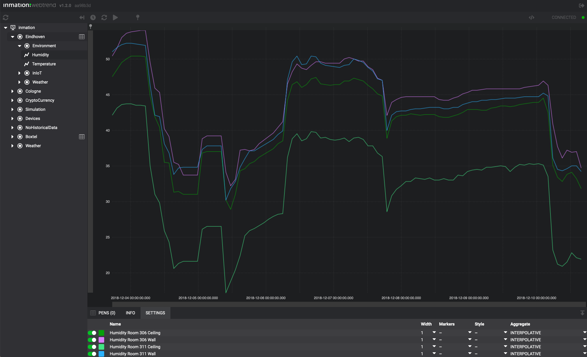
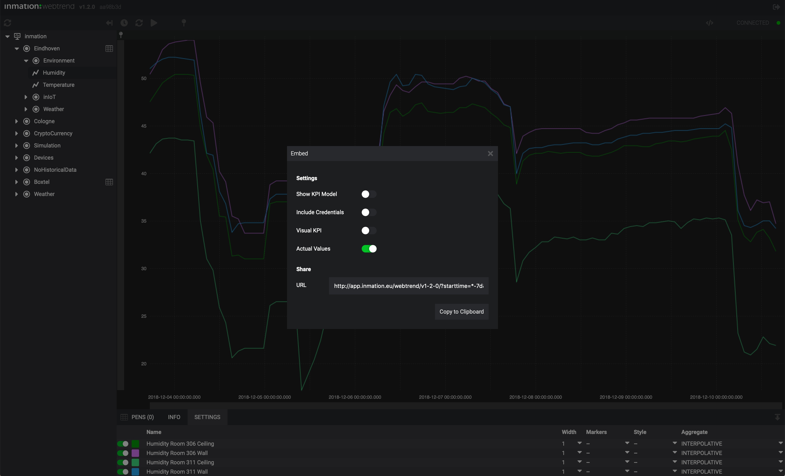

# inmation:webtrend

**inmation:webtrend** is a trend display application with the chart's data directly coming from the system:inmation. System:inmation and the WebTrend is a powerful combination, allowing the end user to track, compare and spot abnormalities that are crucial for continues operations, in close to the real event time, giving that extra edge for swift decision making. \
Trends between system:inmation and the WebTrend are streamed by the inmation Web API (Application Programming Interface), which is hosted in the Windows Service. It can be used by any external application as an interface to system:inmation, using the HTTP or WebSocket Interface. This architecture allows a very fast data streaming.

## 1. inmation:webtrend features

WebTrend offers users a neat interface and extensive functionality. Most important features are as follows:

| Feature | Description |  
|---------|-------------|
| Web application | system:inmation DataStudio already offered a RealTimeTrend display, the main differences between DataStudio RealTimeTrend display and the WebTrend is that WebTrend is a web application, while the RealTimeTrend is build in DataStudio. |
| Actual values | Actual values are the last know values of the item, they are displayed on the right bottom corner of the WebTrend screen. |
| Live | Live trend streaming is an option to play the selected trends. When play button is pressed the actual values are incoming with a 10 second interval and are directly displayed on your screen as a number value and as a trend. |
| KPI model | On the left side of the WebTrend inmation KPI model is displayed. Which KPIs are displayed in the KPI model can be tailored in the DataStudio, by adding items and pens or removing them. |
| Share option | Your tailored view can be shared through a share option. To share click on **</>**, which is on the top right corner of the screen. Share settings allows the user to choose whether or not he wishes to share the view with a KPI Model, Include Credentials, enable Visual KPI usage or share Actual Values. |

## 2. Tag table

A tag table is a table containing objects from the system:inmation DataStudio I/O model. Tag table can by created in the DataStudio I/O model as a Table Holder item with the following fields: Name, Descr and Path. Apply changes and the newly created tag table should be visible in your WebTrend KPI model.
Tag table items are indicated by a table icon in the KPI model. Select the item with the table icon and add desired pens from the pen table to the trend. Pen table can be accessed at the bottom left side of the screen.

## 3. DataStudio and the WebTrend

DataStudio version 1.46 or higher supports the WebTrend display. To open the WebTrend in the DataStudio, start DataStudio in the adventurous mode, choose item in the I/O model, right mouse click on the selected item and add item to the WebTrend. WebTrend will be displayed in the display section of the DataStudio.

## 4. Visual KPI and WebTrend

The users of Visual KPI can benefit from the WebTrend too, as it can be embedded into Visual KPI dashboard.

## 5. Deployment

WebTrend is shipped with inmation Web API starting from 1.46 version. WebTrend can be accessed via the following URL links:
| Description  | URL |  
|---------|-------------|
| Base URL | http(s)://baseaddress/static/webtrend/ |
| KPI model view | http(s)://baseaddress/static/webtrend/?showkpiodel=true |
| Tag Table view | http(s)://baseaddress/static/webtrend/?tagtable=/system/core/your%tag&table |

Alternatively, WebTrend can be downloaded from: app.inmation.com.